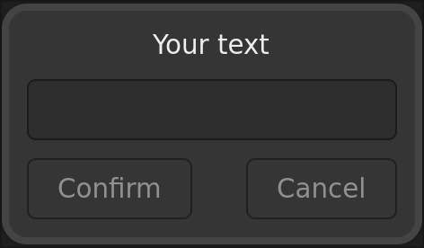

# Gaskpass

This tool can be used in a combination with sudo:

```sh
$ SUDO_ASKPASS=gaskpass sudo --prompt "Your text" --askpass ls -l
```

Which results in



Basically it's a sudo-friendly replacement of `zenity --password`.

It's used with (or rather by) `sudo` and so of course it respects `/etc/sudoers`.

Additionally, there's a `gaskpass-sudo` script that passes given args as both prompt and command:

```sh
gaskpass-sudo ls -l
```

# Building

```sh
$ meson setup build --buildtype=release
$ meson compile -C build
$ meson install -C build
```
